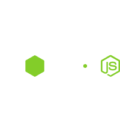

## Frontend & Frameworks:
  

     
    &emsp;
     
    &emsp;
     
    &emsp;
     
    &emsp;
     
    &emsp;
     
    &emsp;
     
  

## Backend & Database:
  

    <picture>
      <source media="(prefers-color-scheme: dark)" srcset="node(white).svg">
      <source media="(prefers-color-scheme: light)" srcset="node(dark).svg">
      
    </picture> 
    &emsp;
    <picture>
      <source media="(prefers-color-scheme: dark)" srcset="ex(white).svg">
      <source media="(prefers-color-scheme: light)" srcset="ex(black).svg">
      
    </picture> 
    &emsp;
     
  

## Tools & Deployment:
  

     
    &emsp;
    <picture>
      <source media="(prefers-color-scheme: dark)" srcset="github(white).svg">
      <source media="(prefers-color-scheme: light)" srcset="github(black).svg">
      
    </picture> 
    &emsp;
     
    &emsp;
     
    &emsp;
     
    &emsp;
     
    &emsp;
    <picture>
      <source media="(prefers-color-scheme: dark)" srcset="vercel(white).svg">
      <source media="(prefers-color-scheme: light)" srcset="vercel(black).svg">
      
    </picture> 
    &emsp;
     
  

## AI Tools:
  

    <picture>
      <source media="(prefers-color-scheme: dark)" srcset="chatGPT(white).svg">
      <source media="(prefers-color-scheme: light)" srcset="chatGPT(black).svg">
      
    </picture> 
    &emsp;
    <picture>
      <source media="(prefers-color-scheme: dark)" srcset="copilot(white).svg">
      <source media="(prefers-color-scheme: light)" srcset="copilot(black).svg">
      
    </picture> 
    &emsp;
     
  

## Creative:
  

     
    &emsp;
     
    &emsp;
     
  

